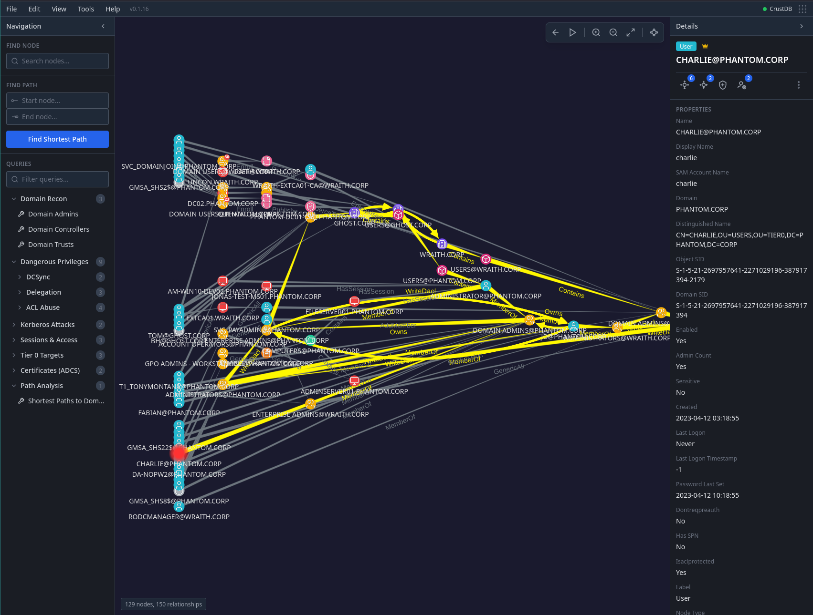

ADMapper
========

An alternative BloodHound front-end



ADMapper can be run as standalone Tauri-based Desktop app or inside a Docker container.
The data lives in a single file in form of a SQLite database. Neo4j is also
supported, but not needed.

Get started here: [Quickstart](https://adrianvollmer.github.io/ADMapper/#quick-start)

For a double-quick Quickstart, run this:

```console
mkdir -p data && docker run --rm -it --init \
    -p 9191:9191 -v ./data:/data \
    ghcr.io/adrianvollmer/admapper-neo4j
```

Backends
--------

1. *CrustDB*: an experimental, embedded graph database based on SQLite
2. *Neo4j*: for best performance, ADMapper can connect to a Neo4j just like
   BloodHound
3. *FalkorDB*: Similarly to BloodHound, FalkorDB can also be used

Installation
------------

Go to the [Release page](https://github.com/AdrianVollmer/ADMapper/releases) and
download the binary for your operating system. Packages for convenient
installation are also provided for Windows, MacOS, AppImage and Debian.

Documentation
-------------

For details, read the [docs](https://adrianvollmer.github.io/ADMapper).


License
-------

MIT
